# Portfolio

태양광 발전소 관리 · 모니터링 · 유통 관리 도메인에서 작업한 프로젝트 모음입니다.
백엔드(Node.js/Express, Java/Spring)와 프론트엔드(Vue, React)를 함께 다루며,
실제 운영 중인 B2B/B2C 웹 서비스를 설계·개발했습니다.

---

## 프로젝트 목록

### [atglobal/ao-web](./atglobal/ao-web) — AT Global 종합 관리 시스템
파워뱅크 제조사의 유통 구조(제조 → 총판 → 대리점)를 통합 관리하는 B2B 웹 시스템.
발주/재고/거래명세서 관리, 역할별(관리자·총판·대리점) 권한 분리를 구현.
- **Stack**: Vue 3, Node.js/Express, PostgreSQL
- 상세 기획서: [`docs/SPEC.md`](./atglobal/ao-web/docs/SPEC.md)

  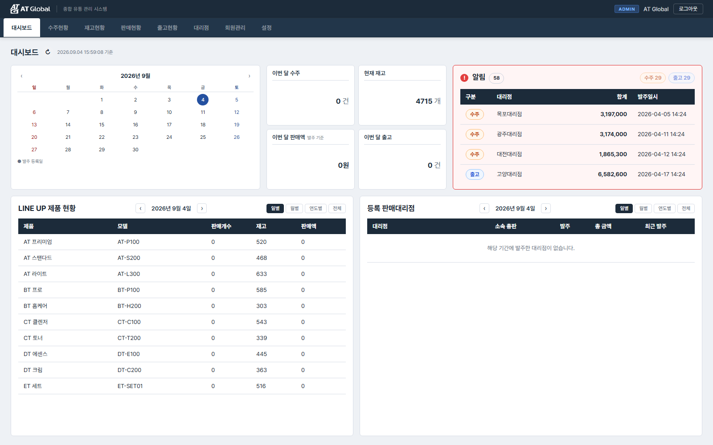
  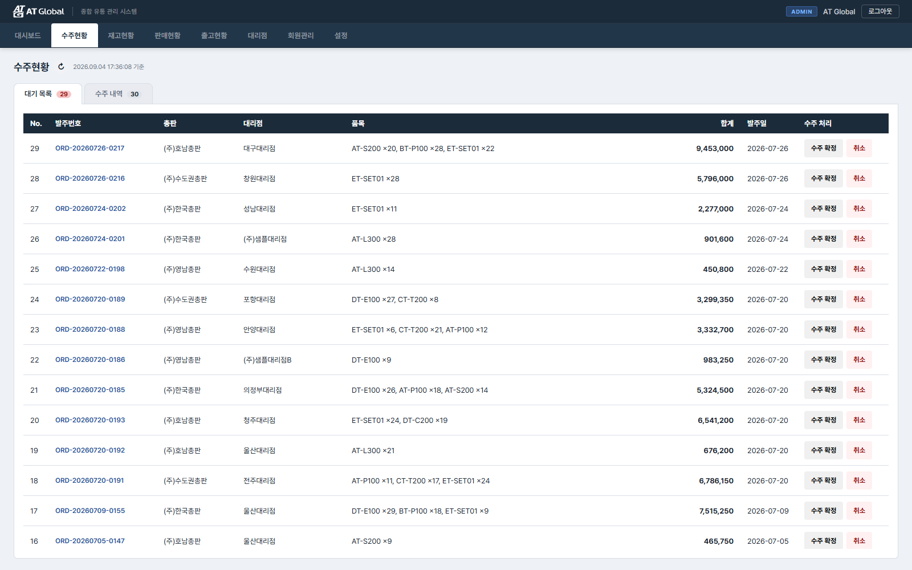

  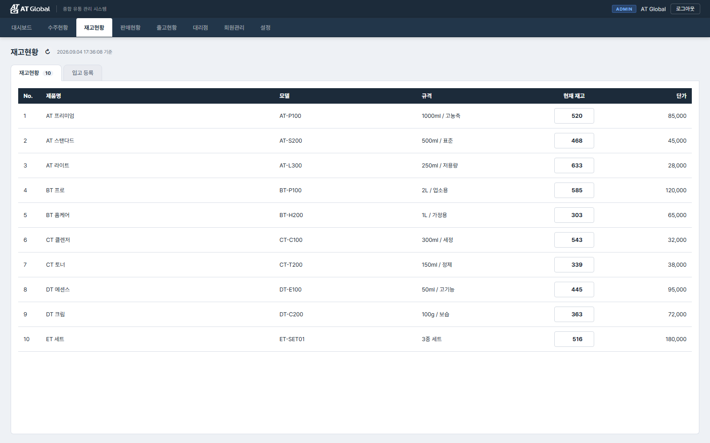
  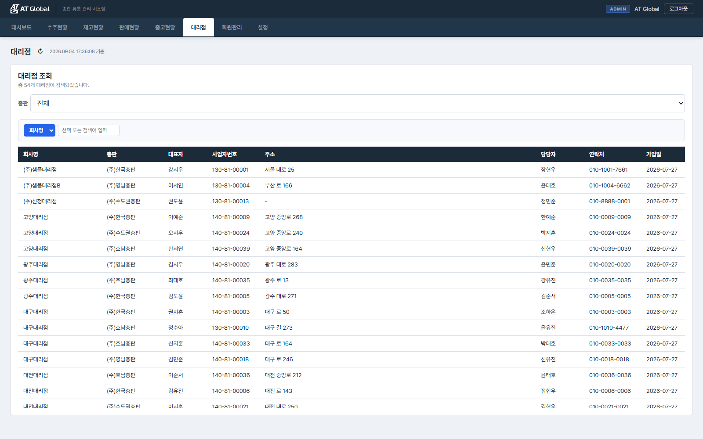

### [daeyang/dm-web](./daeyang/dm-web) — 태양광 발전 모니터링 (v2)
대양기업 태양광 발전소들의 발전량·설비·안전관리 현황을 대시보드로 모니터링.
지도 기반 발전소 현황, 시공/안전 이력 관리 기능 포함.
- **Stack**: React, Express, MariaDB, Google/Kakao/Naver Map API

  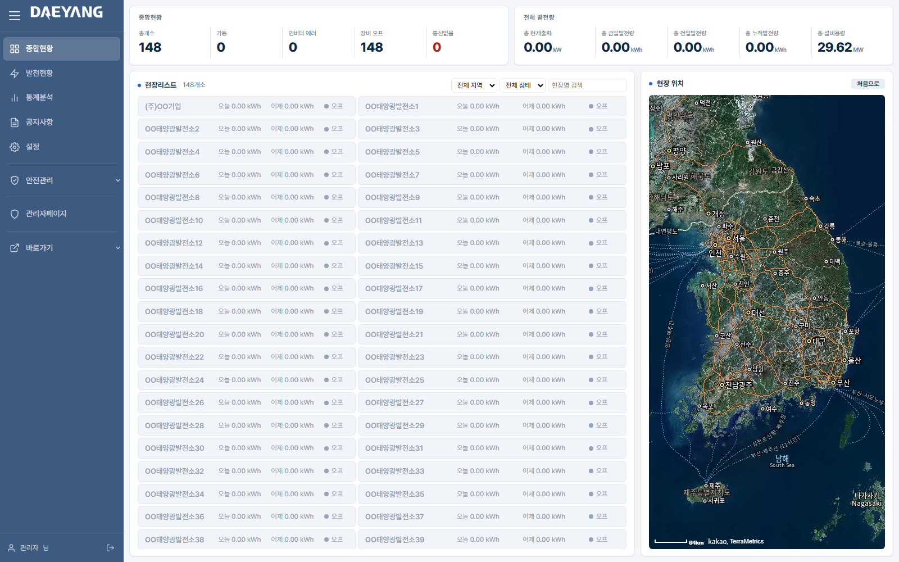
  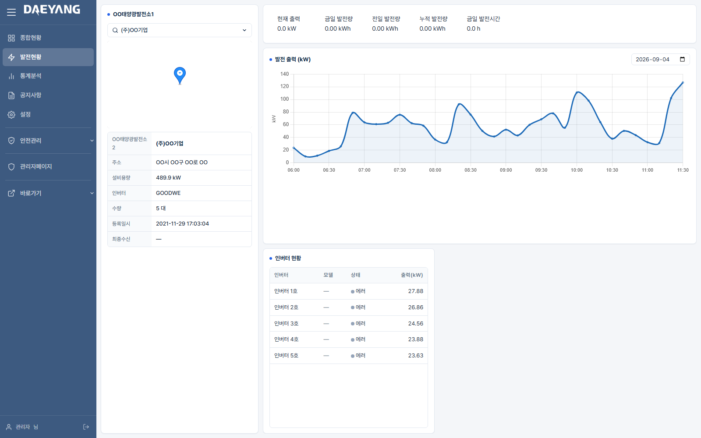

  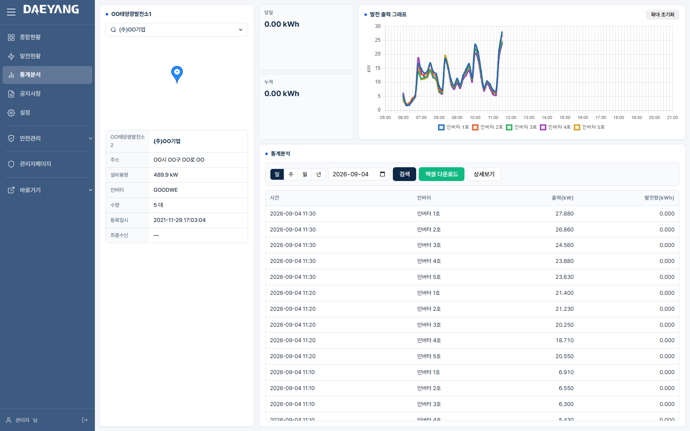

### [daeyang/ht-web](./daeyang/ht-web) — 태양광 세금계산서 발행 시스템
태양광 발전소 매출에 대한 전자세금계산서를 발행/이력 관리하는 시스템.
외부 세금계산서 연동 API와 연결되어 실제 국세청 발행까지 처리.
- **Stack**: Node.js/Express, MariaDB

  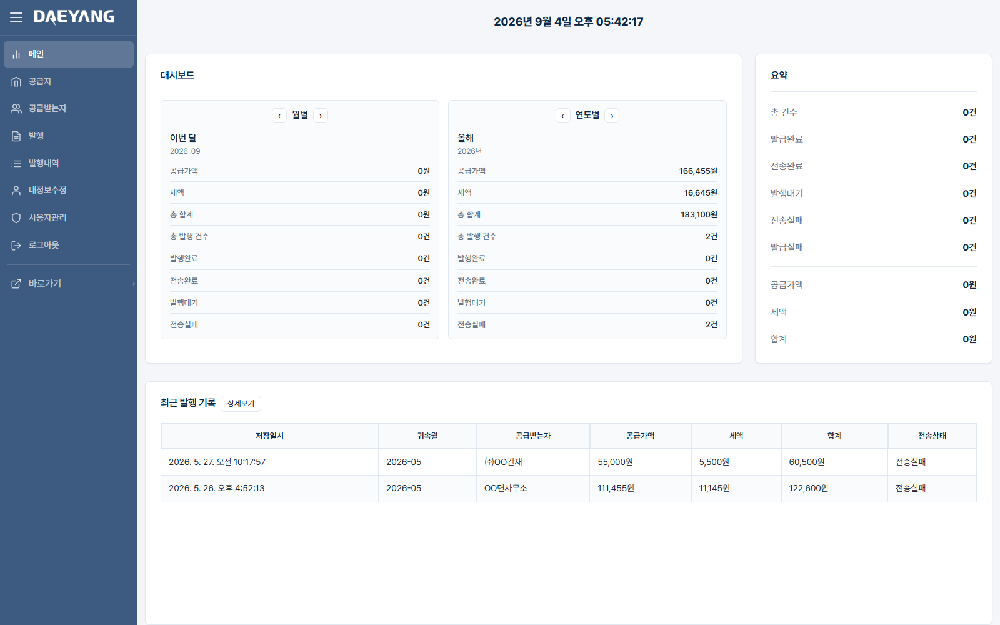

### [daeyang/bd-web](./daeyang/bd-web) — 발전소 인허가 일정관리 캘린더
태양광 발전소 인허가 절차의 일정을 캘린더 형태로 관리하는 도구.
- **Stack**: Node.js/Express, MariaDB

  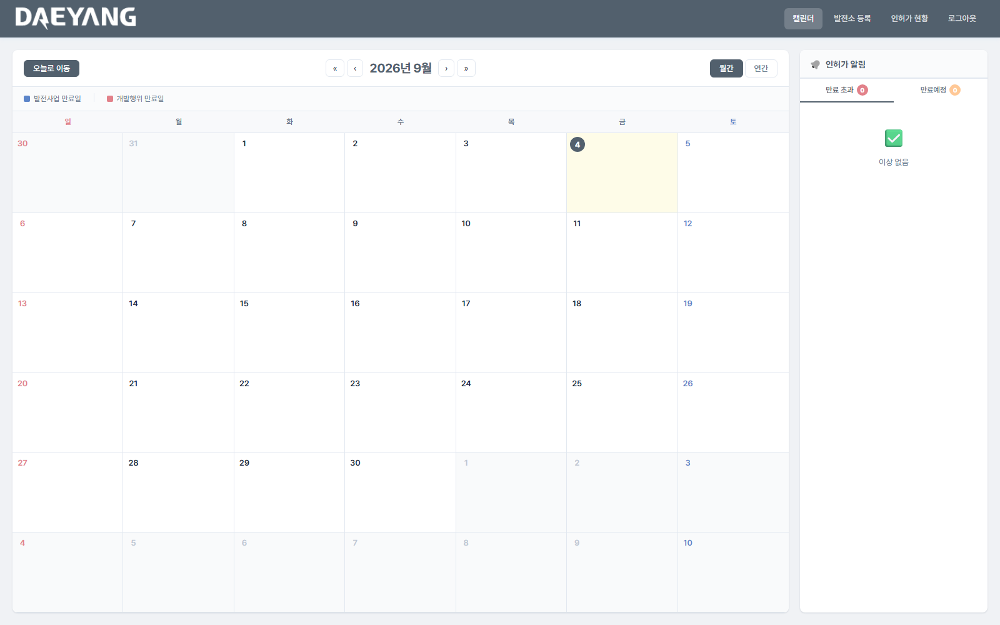
  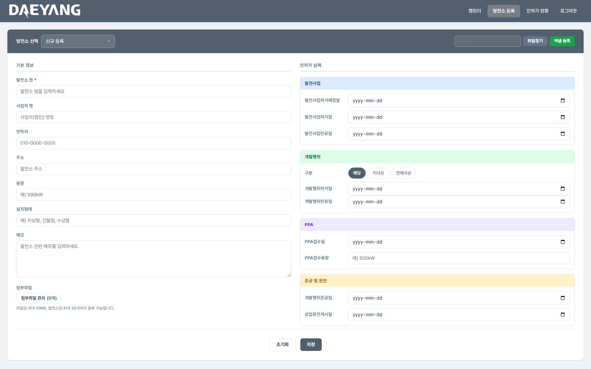

### [daeyang/dymonitering](./daeyang/dymonitering) — 태양광 통합 모니터링 시스템 (Legacy)
전자정부 표준프레임워크(eGovFrame) 기반의 회원/발전소/청구/게시판 통합 관리 시스템.
발전소별 실시간 발전량 조회, 관리자 통계, 회원 대행 결제 등 대규모 기능을 포함한
레거시 Java 웹 애플리케이션.
- **Stack**: Java, Spring, eGovFrame, MyBatis, MySQL/Oracle

  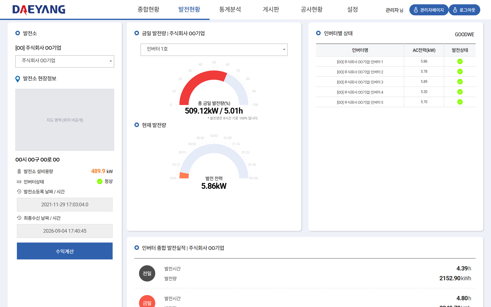
  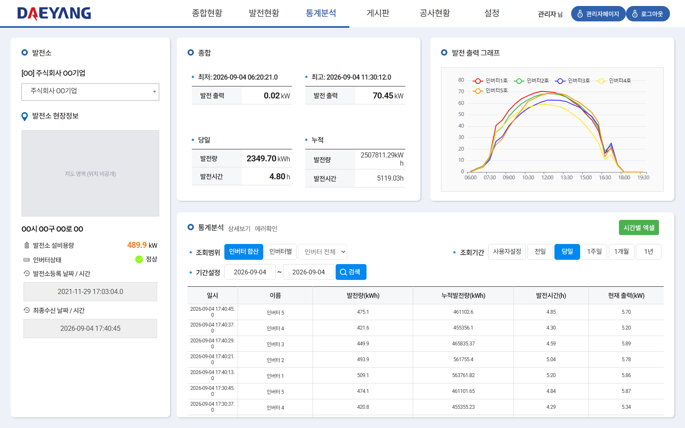

### [daeyang/485_emulator](./daeyang/485_emulator) — RS485 인버터 통신 에뮬레이터
태양광 인버터와의 RS485/Modbus 통신을 재현하는 데스크톱 에뮬레이터.
실제 인버터 장비 없이 통신 프로토콜을 테스트하기 위해 제작.
- **Stack**: Python, PyQt5, pyserial

---

## 연락처

oikio7924@gmail.com
